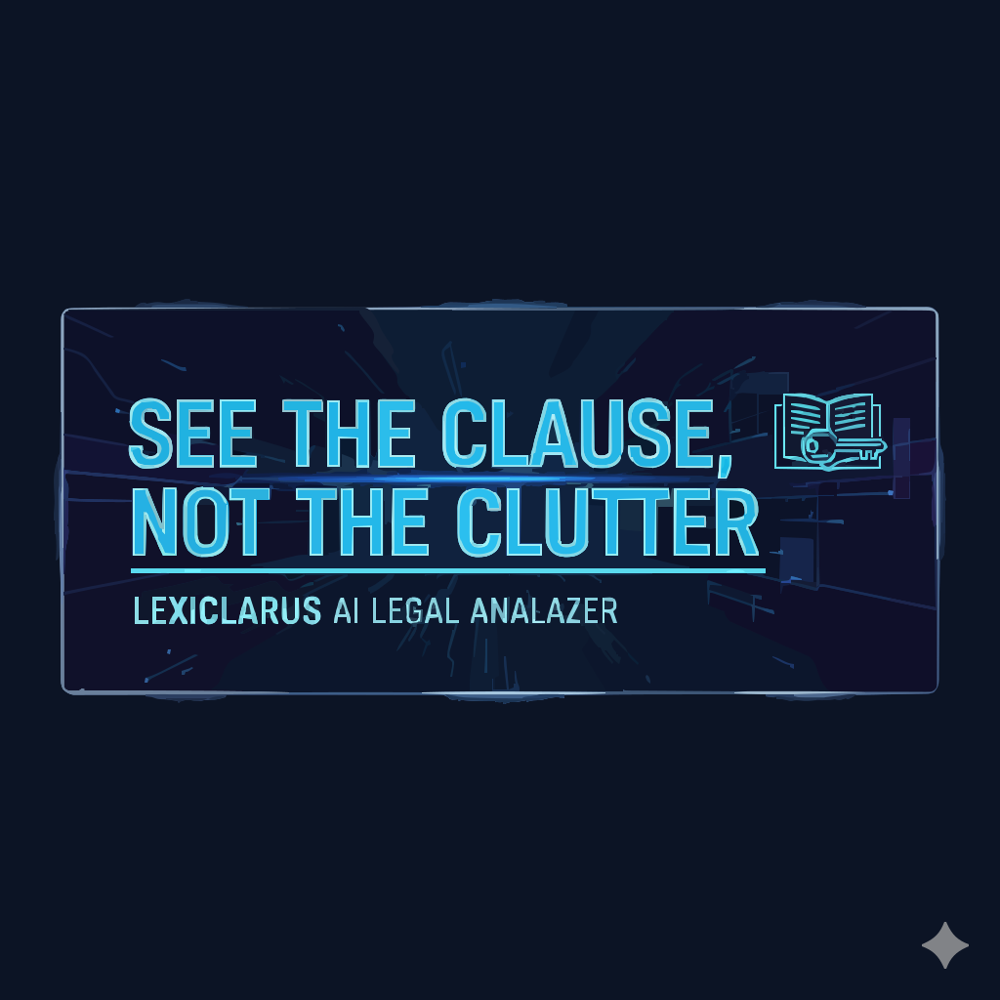
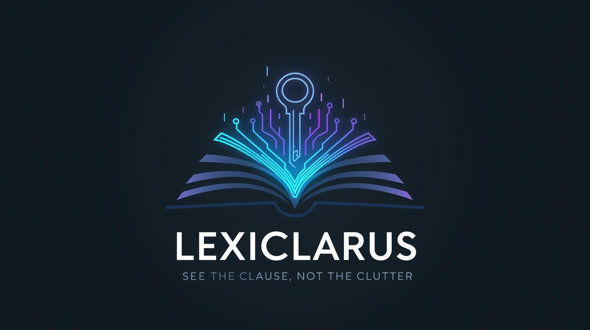
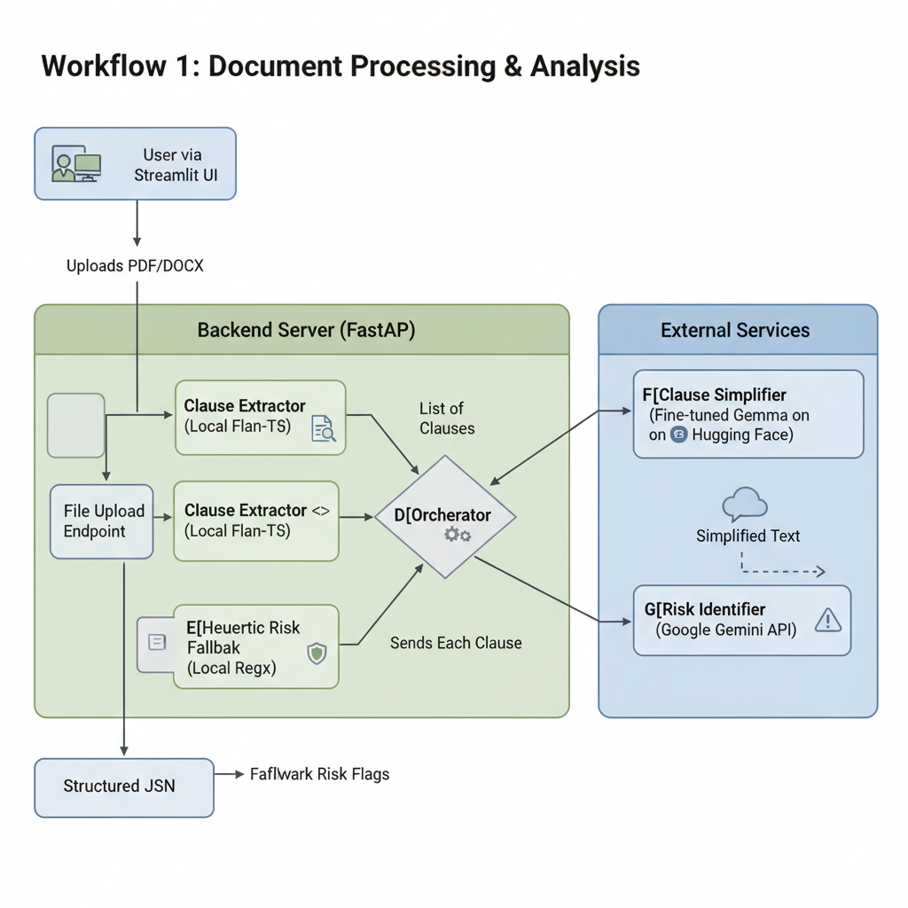
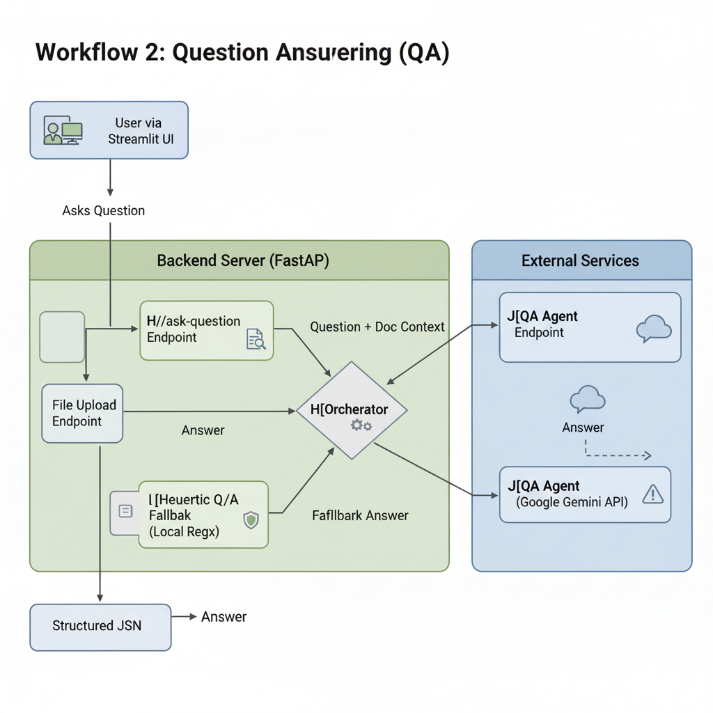

# ⚖️ LexiClarus

<p align="center">
  
</p>

<p align="center">
  
</p>

<p align="center">
  
  <!-- Tech Stack Badges -->
  
  
  
  
  

  <br/>

  <!-- Project Theme Badges -->
  
  
  
  
  
</p>

---
LexiClarus makes legal contracts easier to understand. It extracts complex clauses, rewrites them into plain English, flags potential risks, and answers questions about the document.  

---

## 🚀 What It Does
- 📄 **Extracts clauses** from uploaded PDF/DOCX contracts.  
- ✍️ **Simplifies legal text** into easy-to-read language.  
- ⚠️ **Highlights risks** (e.g., penalties, auto-renewals, fees).  
- ❓ **Answers questions** about the contract.  

---

## 🧠 Core Models
- **Fine-tuned Gemma** → Clause simplification (trained on legal dataset, hosted on Hugging Face Spaces).  
- **Flan-T5 (google/flan-t5-base)** → Clause extraction (CPU-friendly).  
- **Gemini 2.0 Flash** → Risk identification & Q&A (with heuristic fallback).  

- ***Link for fine-tuned model*** : (https://huggingface.co/spaces/Aryan-2511/LexiClarus)

---

## 🕹️ Agents
The system runs through **four modular agents**:  

1. **Extractor** → Flan-T5 splits contract into structured clauses.  
2. **Simplifier** → Fine-tuned Gemma rewrites clauses in plain English.  
3. **Risk Identifier** → Gemini or fallback heuristics detect risky terms.  
4. **QA Agent** → Answers user questions about the contract.  

---

## 🏗️ Architecture
<p align="center">
  
</p>  

<p align="center">
  
</p>  

---

## 🔧 Quick Start
```bash
# 1. Clone repo
git clone https://github.com/Aryan-2511/LexiClarus.git
cd LexiClarus

# 2. Setup environment
python -m venv venv
source venv/bin/activate   # Windows: venv\Scripts\activate
pip install -r requirements.txt

# 3. Configure .env
HF_SPACE_ID=Aryan-2511/LexiClarus
HF_SPACE_TOKEN=   
GEMINI_API_KEY=   # (for Risk/QA agents)

# 4. Run backend
uvicorn main:app --reload

# 5. Run frontend
streamlit run app.py
```

---

## 📊 Workflow
1. Upload a **PDF/DOCX contract**.  
2. Backend pipeline:  
   - Extract clauses (Flan-T5).  
   - Simplify text (Gemma HF Space).  
   - Identify risks (Gemini / heuristics).  
3. Frontend (Streamlit) displays:  
   - 📝 Simplified explanation  
   - ⚠️ Risk flags  
   - 📜 Original text  
4. Ask custom questions about the whole document.  

---

## ⚡ Features
- Modular → swap agents independently.  
- Hugging Face hosted simplifier → trial-ready.  
- Gemini integration with safe fallback.  
- Clean UI built in Streamlit.  

---

## 🖼️ Screenshots
<p align="center">
  
</p>  
<p align="center">
  
</p>  
<p align="center">
  
</p>  
<p align="center">
  
</p>  
<p align="center">
  
</p>  
<p align="center">
  
</p>  

---

## 📌 Roadmap
- Fine tune LLMs for other tasks (i.e.Risk identification and QA) as well.
- Improve segmentation for long contracts.  
- Add richer risk categories.  
- Export results (CSV, JSON, PDF).  
- Batch process multiple documents.  

---
## 🤝 Contributing

Contributions are welcome! 🎉  
If you’d like to add new features or suggest improvements, feel free to open an issue or PR.

---

## 👨‍💻 Author

Made with ❤️ by **Aryan**  

- 🌐 GitHub: [Aryan-2511](https://github.com/Aryan-2511)  
- 🤗 Hugging Face: [Aryan-2511](https://huggingface.co/Aryan-2511)  

---
